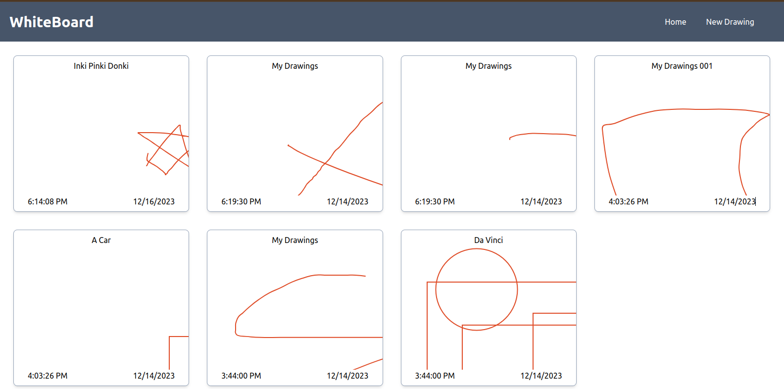
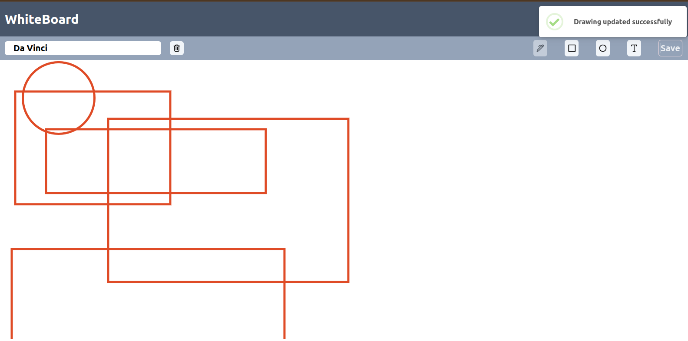

[Live Demo](https://whiteboardx.vercel.app/)
# WhiteBoard App





## Table of Contents

- [Introduction](#introduction)
- [Features](#features)
- [Prerequisites](#prerequisites)
- [Installation](#installation)
- [Usage](#usage)
- [Deployment](#deployment)
- [Contributing](#contributing)
- [License](#license)

## Introduction

: A simple whiteboard app with basic features.
: Built with React.js Tailwind CSS, React Konva, NodeJs, MongoDB.

## Prerequisites

- Node.js (v16+)
  - React
  - React Konva
  - Tailwind CSS
  - MongoDB
  - Nodejs
-

## Installation

1. Clone the repository:

   ```bash
   git clone https://github.com/mamun-mahmood/whiteboard.git
   cd whiteboard
   ```

2. Install dependencies:

   ```bash
   npm install
   "if there's dependency conflict run"
   npm install -f
   ```

3. Run the application:

   ```bash
   npm run dev
   ```

## Usage
- Create a new board
- Draw on the board
- Save the board
- New board will be created and shown on the home page
- Click on the board to open it
- Click on the board name to rename it or edit it.
- Go to the home page to see all the boards

## Deployment

- Deployed on Vercel
- [Live Demo](https://whiteboardx.vercel.app/)

## Contributing

- Pull requests are welcome. For major changes, please open an issue first to discuss what you would like to change.
- Please make sure to update tests as appropriate.

## License

[MIT](https://choosealicense.com/licenses/mit/)
